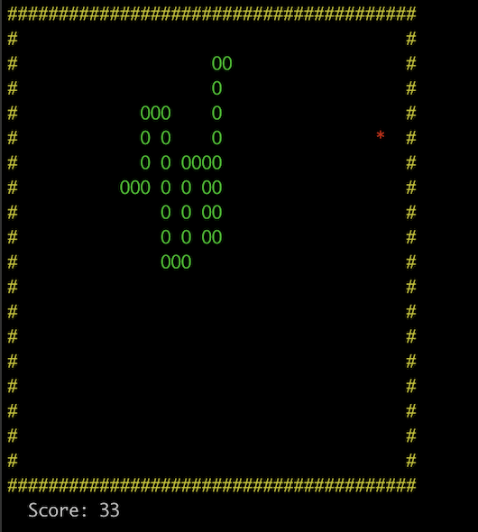

# c-snake-from-scratch

A real-time terminal Snake game written in C from the ground up — without relying on standard libraries like `string.h`, `math.h`, or `malloc`/`free`. Every core subsystem (memory allocation, string operations, math utilities, terminal rendering, and keyboard input) is implemented from scratch.

---

## Demo

[](./assets/demo.mp4)

<video src="./assets/demo.mp4" controls width="600"></video>

---

## Features

- **Custom Memory Allocator** — A static-pool allocator with first-fit allocation, block splitting, and free-block coalescing. Replaces `malloc`/`free` entirely.
- **Custom String Library** — Length, copy, compare, concat, split, and integer-to-string conversion. No dependency on `<string.h>`.
- **Custom Math Library** — Arithmetic, clamping, bounds checking, and a Linear Congruential Generator (LCG) for pseudo-random numbers.
- **Terminal Rendering Engine** — ANSI escape code abstraction for cursor positioning, color control, and flicker-free rendering via dirty-rectangle updates.
- **Non-Blocking Keyboard Input** — Raw `termios` mode with `fcntl` for real-time, non-blocking key capture without external libraries.
- **Linked-List Snake** — Dynamic growth via custom allocator. No fixed-size arrays or artificial length caps.
- **Collision Detection** — Wall boundary checks and full self-collision detection via linked-list traversal.
- **Score Tracking and Game States** — State machine with PLAYING, PAUSED, and GAMEOVER states.

---

## Architecture

```
                    +-----------+
                    |  main.c   |
                    | (lifecycle|
                    |  + loop)  |
                    +-----+-----+
                          |
          +---------------+---------------+
          |                               |
   +------+------+                +-------+-------+
   | keyboard.c  |                |    game.c     |
   | (termios    |--- input ----->| (state, logic,|
   |  raw mode)  |                |  rendering)   |
   +-------------+                +---+-+-+---+---+
                                      | | |   |
                    +-----------------+ | |   +----------------+
                    |          +--------+ +--------+           |
              +-----+----+ +--+------+  +--+------+   +-------+------+
              | memory.c  | | string.c|  |  math.c |   |  screen.c    |
              | (pool     | | (custom |  | (arith, |   | (ANSI escape |
              |  allocator)| |  ops)  |  |  PRNG)  |   |  rendering)  |
              +-----------+ +---------+  +---------+   +--------------+
```

**Data flow per tick:**
```
keyPressed() --> readKey() --> game_handle_input() --> game_update() --> game_render()
                                                          |                   |
                                              mem_alloc / mem_free     screen_put_char
                                              math_rand / math_clamp  screen_flush
```

---

## Controls

| Key | Action |
|-----|--------|
| `W` or `Up Arrow` | Move Up |
| `A` or `Left Arrow` | Move Left |
| `S` or `Down Arrow` | Move Down |
| `D` or `Right Arrow` | Move Right |
| `Q` | Quit |

---

## Build and Run

**Prerequisites:** GCC and Make (macOS / Linux).

```bash
make clean && make
./snake
```

Or compile directly:

```bash
gcc -Wall -Wextra -pedantic -std=c99 -I include -o snake \
    src/memory.c src/string.c src/math.c src/screen.c \
    src/keyboard.c src/game.c src/main.c
./snake
```

---

## Project Structure

```
c-snake-from-scratch/
├── include/
│   ├── memory.h        Pool allocator API
│   ├── string.h        Custom string operations
│   ├── math.h          Arithmetic, bounds, PRNG
│   ├── screen.h        ANSI terminal rendering
│   ├── keyboard.h      Non-blocking input
│   └── game.h          Game state, types, logic API
├── src/
│   ├── memory.c        64KB static pool, first-fit, coalescing
│   ├── string.c        len, copy, compare, concat, split, itoa
│   ├── math.c          abs, mul, div, mod, clamp, rand (LCG)
│   ├── screen.c        Cursor, color, border, buffered flush
│   ├── keyboard.c      termios raw mode, parsing multi-byte escape sequences
│   ├── game.c          Snake logic, rendering, state machine
│   └── main.c          Init, game loop, cleanup
├── Makefile
└── README.md
```

---

## Technical Highlights (For Recruiters)

This project demonstrates depth in several core areas of systems programming:

**Low-Level Memory Management**
- Designed and implemented a custom heap allocator from a static byte array
- First-fit allocation strategy with block splitting and free-block coalescing
- Zero reliance on `malloc`, `free`, or any dynamic memory API

**Systems Programming**
- Direct use of POSIX `termios` for terminal control (raw mode, echo suppression)
- File descriptor manipulation via `fcntl` for non-blocking I/O
- Explicit parsing of multi-byte ANSI escape sequences for Arrow Key support
- ANSI escape code protocol for cursor movement and color rendering

**Data Structures**
- Snake body implemented as a singly linked list with dynamic allocation
- Custom memory pool managed via an embedded free-list

**Real-Time Systems Design**
- Fixed-timestep game loop with chunked sleep for input responsiveness
- Dirty-rectangle rendering strategy (only changed pixels are redrawn)
- Fully buffered stdout for atomic frame presentation (no flicker)

**Software Architecture**
- Clean modular separation across 7 compilation units
- Zero circular dependencies; layered dependency graph
- Each module exposes a minimal public API through its header

---

## Known Limitations

- Terminal window must be at least 40 columns wide and 22 rows tall.
- No persistent high score storage.

---

## Future Improvements

- Difficulty levels with adjustable tick speed
- Persistent high score file I/O
- AI auto-play mode using pathfinding
- Local multiplayer with split controls
- Wraparound (borderless) game mode

---

## License

This project is open source and available under the MIT License.
